# Project-2
Northwestern Bootcamp Project 2 - Evan Sadasivan, Avinash Patel and Christine Nashihibi

## Installation Guide - Technologies utilized

* ### Rapid API - Api Dojo - https://rapidapi.com/apidojo/api/investing-cryptocurrency-markets/

* ### Important to note that the stable coin analysis will require you to open the jupyter lab file in Google Colab. The crypto analysis will be handled with the following Anaconda environment, while the Google Colab instructions will just require a few pip installs. 

* ### Anaconda -
    * Navigate to the Anaconda website in order to download the appropriate installer.
    * https://www.anaconda.com/products/distribution#windows 

* ### Anaconda - conda environment 
            <!-- (After installing Anaconda we need to enable the terminal commands) -->

            conda init bash

            <!-- (Close your terminal and open a new one) -->

            conda update conda
            conda update anaconda

            <!-- (Now we need to create a suitable environment to run our jupyter lab and
             install libraries necessary for pyviz) -->

            conda activate base
            conda create -n pyvizenv python=3.7 anaconda -y

            conda activate pyvizenv

            conda install -c conda-forge python-dotenv -y
            conda install -c anaconda nb_conda -y
            conda install -c conda-forge nodejs=12 -y
            conda install -c pyviz holoviz -y
            conda install -c plotly plotly -y
            conda install -c conda-forge jupyterlab=2.2 -y
            conda install -c anaconda numpy==1.19 -y
            conda install -c conda-forge matplotlib==3.0.3 -y

            jupyter labextension install @jupyter-widgets/jupyterlab-manager --no-build
            jupyter labextension install jupyterlab-plotly --no-build
            jupyter labextension install plotlywidget --no-build
            jupyter labextension install @pyviz/jupyterlab_pyviz --no-build
            jupyter lab build

            <!-- (Remember to also setup a dot env file containing api keys)  -->

* ###  Other libraries - can be quick installed using the following commands in the pyviz environment:
            
            conda install -c conda-forge tensorflow -y
            pip install -U scikit-learn
            pip install imblearn
            
             <!-- (The following will need to be run in google co lab before importing anything and working with the machine learning models.) -->
            
            pip install "dask[complete]"
            pip install hvplot
            pip install auto-ts
            pip install statsmodels
            pip install tscv
            pip install python-dotenv
            

## Overall Aim

Despite the recent downward trend in crypto currencies and stable coins within the previous six months, they continue to be an integral digital currency and form of investment. We will utilize machine learning methods to predict the future outlook of cryto and stable coins for a few months ahead. The result will hopefully give us an educated guess as to how the market will shape out and would it be beneficial to invest or utilize digital currencies. 

The following currencies and coins will be the focus of the analysis:

* Bitcoin 
* Ethereum
* Luna
* Binance - BUSD stable coin
* Tether - USDT stable coin
* Dai - DAI stable coin 
* Coin (Circle) - USDC stable coin 

The models utilized for each form of analysis are listed ahead:
* Evan - SK learn on cryptos
* Christine - Keras on cryptos
* Avi - stablecoins & Auto TS

## General Process

* ## Data collection, Cleaning, Splitting, Fitting, Testing, and Predicting 
The data will be collected using API Dojo from Rapid API website. The link is provided in the the technology used section. After connection has been established we set up GET Requests to retreive the data. Pass the data into a json format for easier parsing and dataframe setup. Using Pandas we are able to parse the data to find the important financial information for the different instruments. Unfortunately the API will only provide 1 years worth of current data. In order to over come this problem we chose to call the data 3 times in with different params in order to get 3 years worth of data. Data will need to  be cleaned. We dropped 'perc_chg' and 'color' columns. We drop any duplicates in the 'date' column before setting the date as the index. Some columns like 'volume' must have the ',' and letter values like - 'K' , 'M', 'B' replaced or evaluated. The last part of the cleaning process will be changing the datatypes for the dataframe.

After having cleaned dataframes, depending on which model you utilize you must split the data into two dataframes: traning and testing. Training data will consist of your oldest data. The test data will be the most recent. A third group of data will need to be used to predict future values i.e. this data will consist of data that is newer and not found in either training or test data sets. Using Open, Close, High, Low, Volume as the features and Price is target (y). This allows us to understand which are the dependent vs independent variables  in our dataframes. Generally speaking in machine learning you will have to first import the necessary libraries to call your models. You instantiate the models by assinging it to a variable and calling the newly defined variable. After calling your model, you take the training data and fit the model using the data. This will train the model and get it ready for backtesting. We will now use the model to predict the values for the test data, this will give us an idea of the models performance. The last step is to feed the model with the newest data and see how the results compare with the data.

* ## Crypto Analysis and Plots
Our crypto analysis employed two libraries to create different models. The first library we used was scikit learn. Our goal was to set up a model that would learn to predict the daily close price of each crypto. The features we gave our models to look at were 'open','high','low', and 'volume'. To set up the models, we took our 3 years data for each of our three cryptos (BTC, ETH, LUNA) and used the following method to prepare our models. First, we split the data for each crypto into test and train splits. Using sklearn's predict feature, we predicted our target and then compared our predicted values against the actual close values for each day. Following this, we used the same steps on our test data. Finally, we looked at how our models would fare if they were tasked with predicting the future. To similute this future predicting, we gave the models an additional 30 days of data for each of our features and set it to predict the close values. 

In order to evaluate how our models performed, we graphed the predicted vs actual close values at each stage (train, test and future). These graphs can be found in the sklearn graphs folder. We also examined their performance by looking at the mean squared error at each stage. The BTC and ETH models were fairly successful in learning to predict the close values. The LUNA model is much more difficult to tell because the values are so much lower. The mean squared error for the luna model for simulated future prediction was 1.29279. Of course, we would have predicted anyway that because of the recent crash in LUNA value, that the model would likely not do as well.

* ## Stable Coin Analysis and Plots
Please keep in mind that stable coins ideally should remain constant in value. With this mindset the analysis of the results will make more sense. For example the RMSE score is the standard deviation of the residuals (prediction errors). Residuals are a measure of how far from the regression line data points are; RMSE is a measure of how spread out are these residuals. Due to the fact we only have 3 years worth of data and that for most of it the price has always remained close to $1.00 you will see that the RMSE scores are miniscule.

* # Auto TS
    Auto TS is a time series modeling library that consists of the aggregate of multiple different TS models for example:- ARIMA, VAR, Prophet, XGBOOST and many others. The claim to fame for Auto TS is that it allows you to run all TS models available in the library with 2 lines of code. The model will take into account rmse values and cross validation scores in order to determine the 'best model'. This 'best model' is then used to predict future forecasts. Auto TS does not require the data to be cleaned and formatted the way most models expect you to do. In the case of FB Prophet the data needs to be broken down a dataframe with ds and y columns. In the case of Auto TS the only expectation is that date be a column rather than the index in the dataframe and that the ts_column (time series column) = date, the target = y and sep=','. Make sure you split the data into train and test dataframes. In the jupyter lab file for stable coin analysis you will see the split is actual 70% to 30%. 70% of the data will be utilized as training and 30% will remain for back testing. Once we have tested our model we will utilize new data that is neither part of the train or test and see what kind of predictions the model will give. The following are the models that were evaluated for best RMSE score on the training data provided.

    * # Augmented Dickey Fuller Test
    Augmented Dickey Fuller Test is an updated version to the orginal DFuller test. This test analyzes whether or not a given data series is stationary or not. Stationary data is data that has no trend nor is it affected by seasonality. In stationary data, summary statistics like mean or variance remain constant. In order to make non stationary data stationary we must apply a lag difference. Differencing allows for the removal of series dependence on time i.e. it makes it stationary. In the case of our analysis BUSD, USDC, and USDT all required Lag-1 difference in order to become stationary. Stationary data is necessary for models like VAR and ARIMA. 

    BUSD - AD Fuller Test - Lag-1 differencing required in order to make stationary. 
        
    DAI - AD Fuller Test 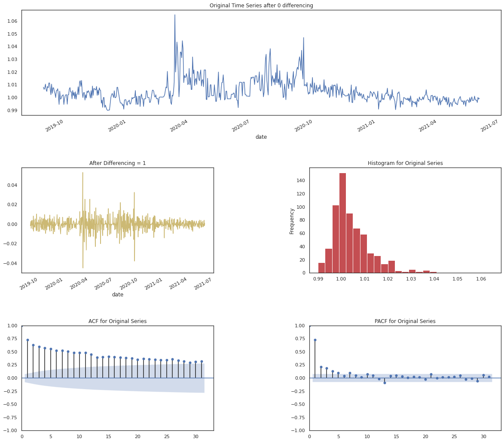

    USDC - AD Fuller Test - Lag-1 differencing required in order to make stationary. 

    USDT - AD Fuller Test - Lag-1 differencing required in order to make stationary. 

    * # Vector AutoRegression (VAR)
    Vector Autoregression (VAR) is a multivariate forecasting algorithm that is used when two or more time series influence each other.Vector Auto Regression (VAR) is bi-directional. VAR models are used in econometrics to determine the affect of policies on a system over time. This is done through an Impulse response function. This function will take data to see what are the impacts of one standard deviation 'shocks' to x and how inturn will these affect y. We can use the function to determine how many standard deviations or time steps will it take for the data to converge. 

   BUSD - VAR model Impulse Response Function 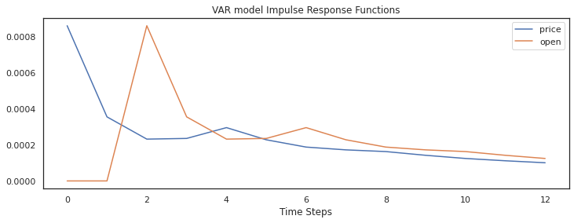

   DAI - VAR model Impulse Response Function 

   USDC - VAR model Impulse Response Function 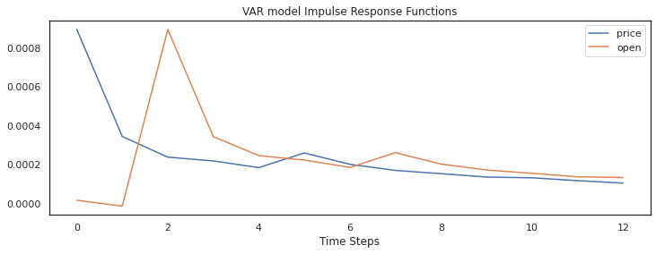

   USDT - VAR model Impulse Response Function 

    * # FB Prophet
    Model used for time series evaluation and forecasting. It works best with data that has seasonality. Due to the data not showing much signs of seasonality, Prophet fell short interms of predicting and RMSE value in comparison to other models.These plots will also show the predicted forecast for the next 3 months from March to June 2022.

    BUSD - Prophet 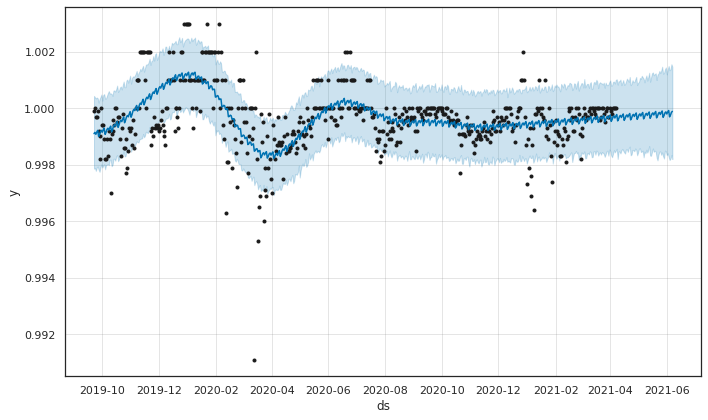 
    
    BUSD - Prophet Predictions 

    DAI - Prophet 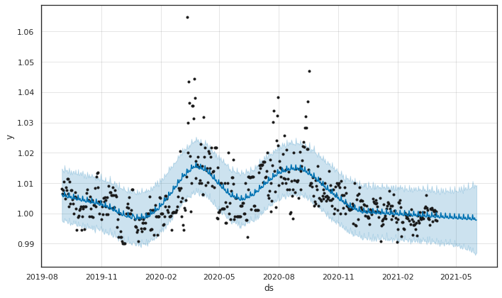

    DAI - Prophet Predictions 

    USDC - Prophet 

    USDC - Prophet Predictions 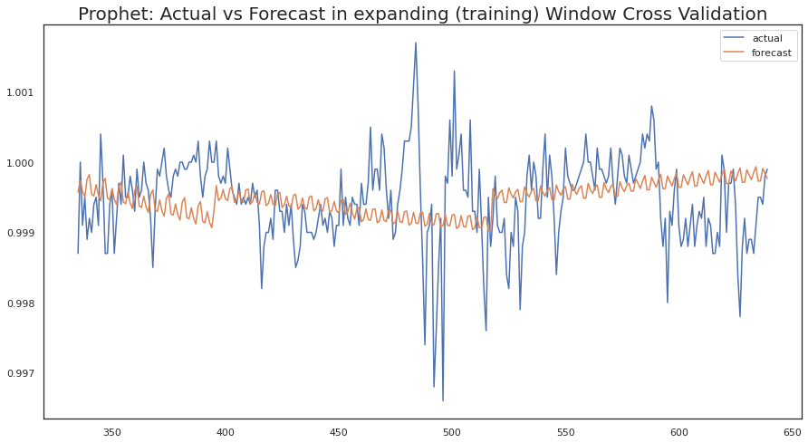

    USDT - Prophet 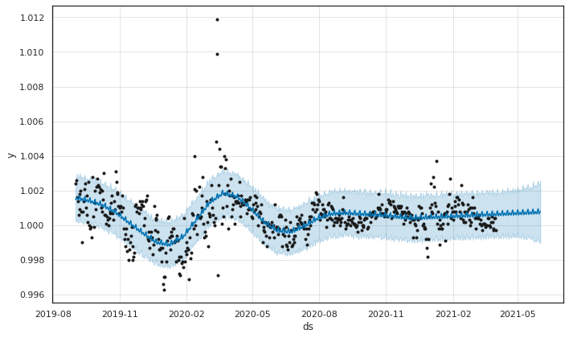

    USDT - Prophet Predictions 

    * # SARIMAX
    The traditional ARIMA model prefers stationary data wheres as the updated Seasonal AutoRegressive Integrate Moving Average w/ eXogenous factors will take in non stationary data. In theory none of the data should show any seasonality, but in terms of RMSE(Root Mean Squared Error) the DAI stable coin works well with the SARIMAX model. This is further perplexing when you take into regard that DAI was the only stable coin that did not require a lag-1  difference in order to become stationary i.e. it was already stationary. 

    BUSD - SARIMAX 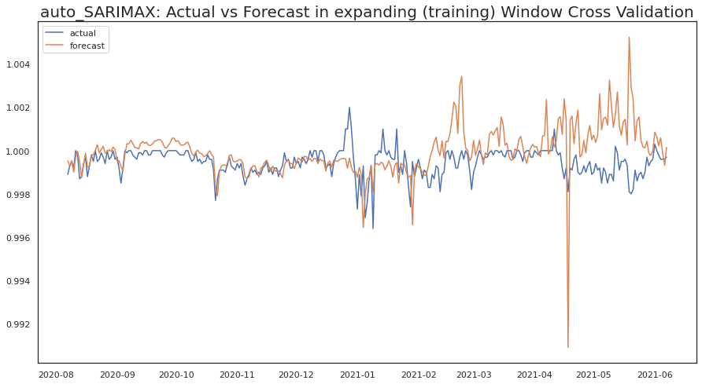

    DAI - SARIMAX 

    USDC - SARIMAX 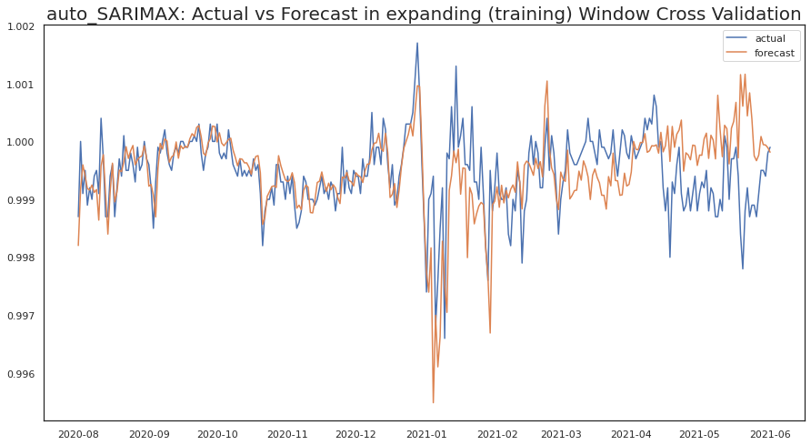

    USDT - SARIMAX 
    * # XGBOOST
    XGBoost is a decision-tree-based ensemble Machine Learning algorithm that uses a gradient boosting framework. In all 4 stable coins the XGBOOST RMSE value came back as infinity. This model will not be a good form analysis for these datasets. 

    * # RMSE Scores

    BUSD - RMSE Scores 
    

    DAI - RMSE Scores 
    ---
    

    USDC - RMSE Scores 
    ---
    

    USDT - RMSE Scores 
    ---
    

    * # Backtesting Results
    Based off the RMSE scores the following models were chosen as the 'best model' for the given coin:- BUSD, USDC, and USDT will utilize the VAR model while DAI will utilize auto SARIMAX model.

    BUSD - VAR Test Results 

    DAI - SARIMAX Test Results 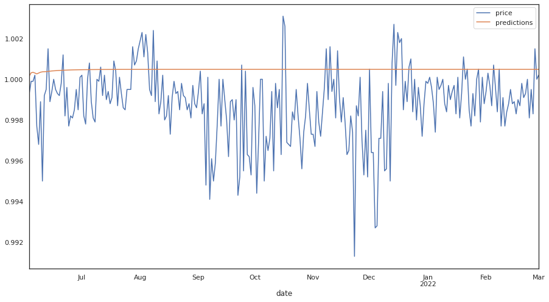

    USDC - USDC Test Results 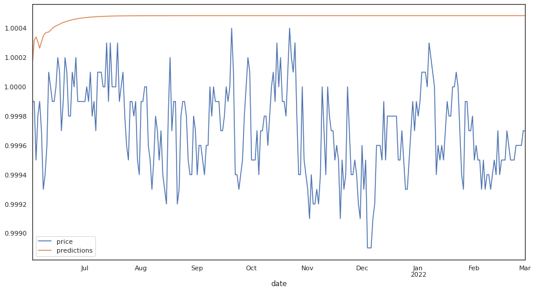

    USDT - USDT Test Results 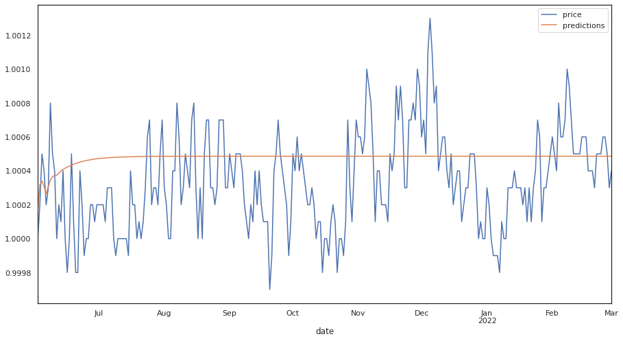
        
    * # Predictions on new data
    Now we will utilize new data from March to June 2022 to make predictions and see how the match up to the actual values.

    BUSD - Future Values 
    ---
    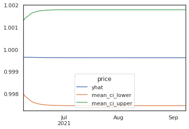
    
    BUSD - Future vs. Actual 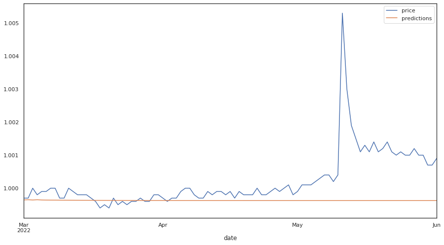

    DAI - Future Values 
    ---
    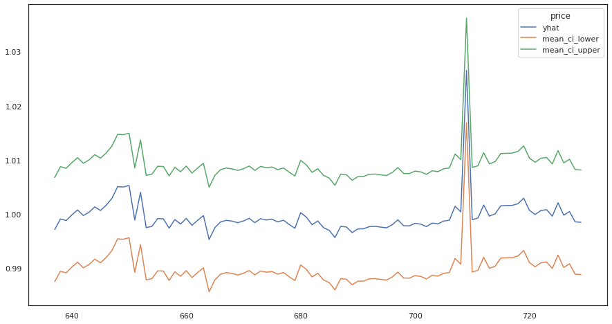

    DAI - Future vs. Actual 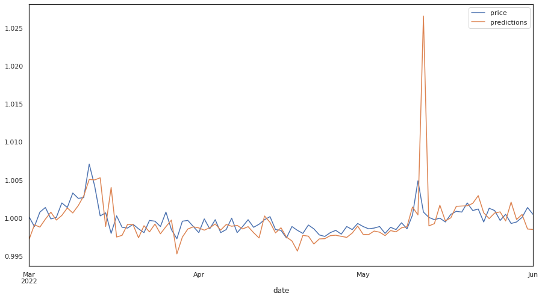

    USDC - Future Values 
    ---
    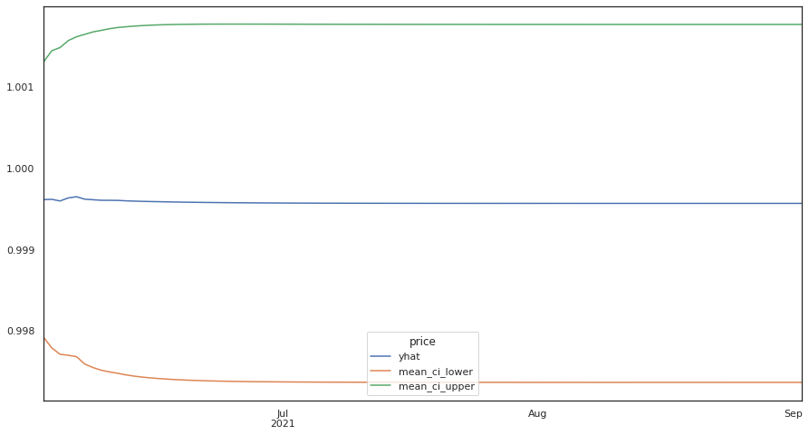

    USDC - Future vs. Actual 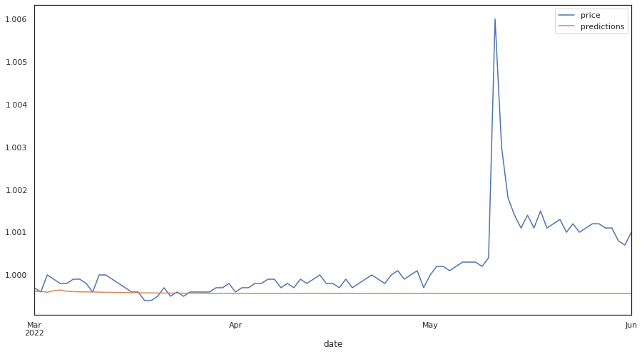

    USDT - Future Values 
    ---
    

    USDT - Future vs. Actual 

    * # Conclusions regarding Stable Coins
    With the help of Auto TS and analysis over multiple models I believe there will stability in stable coins hence making them a valuable financial tool in the coming future. The overall analysis could be better with the help of larger data sets to help train the model as well as maybe trying any of the other models from Auto TS library. 

## Notes/Appendix:

Possible additional forms of analysis: 
We then use NLP to examine how people have responded to crypto and how we predict they will respond.

